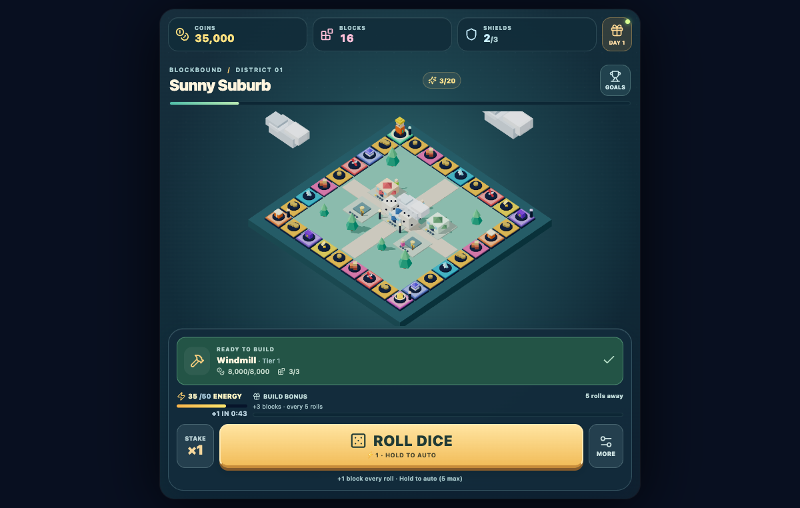
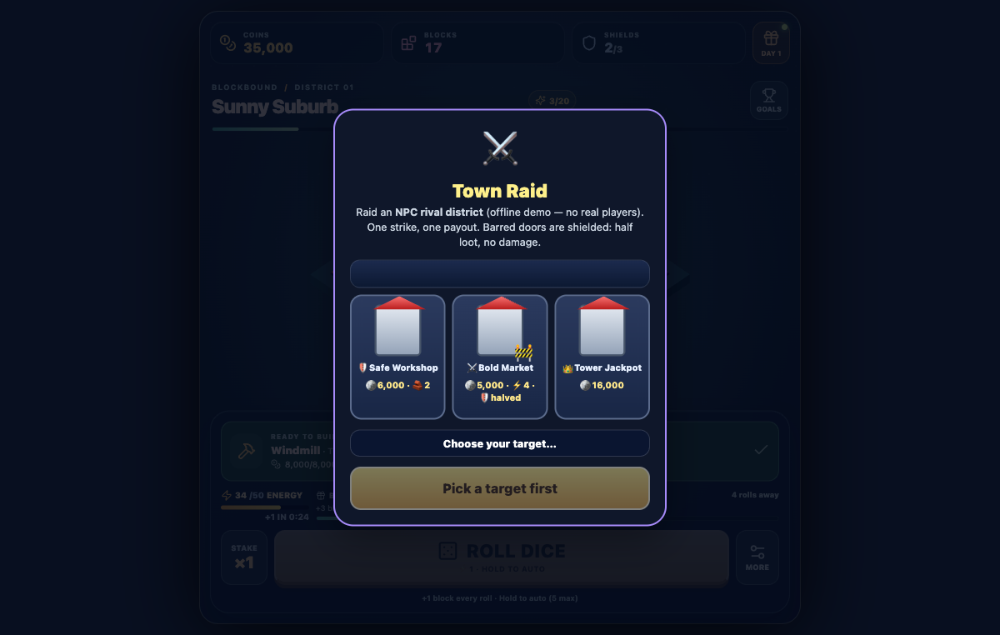
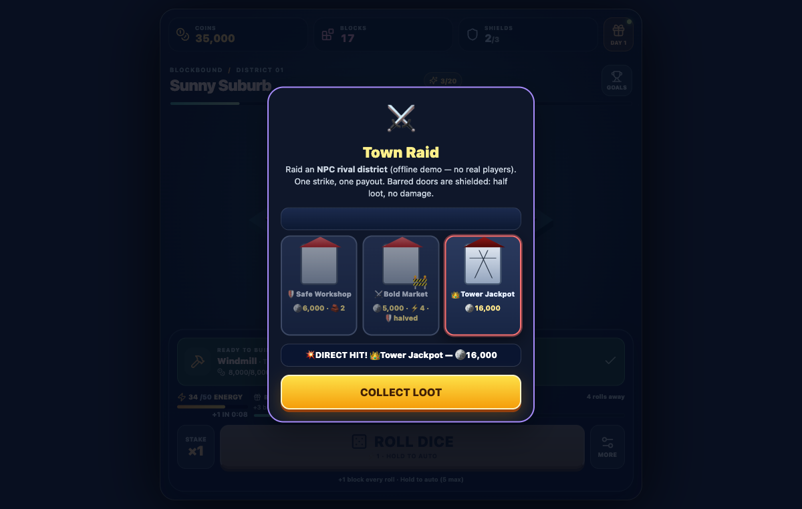
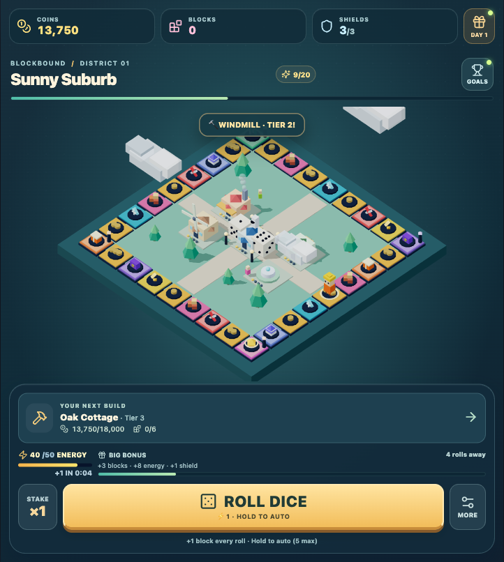
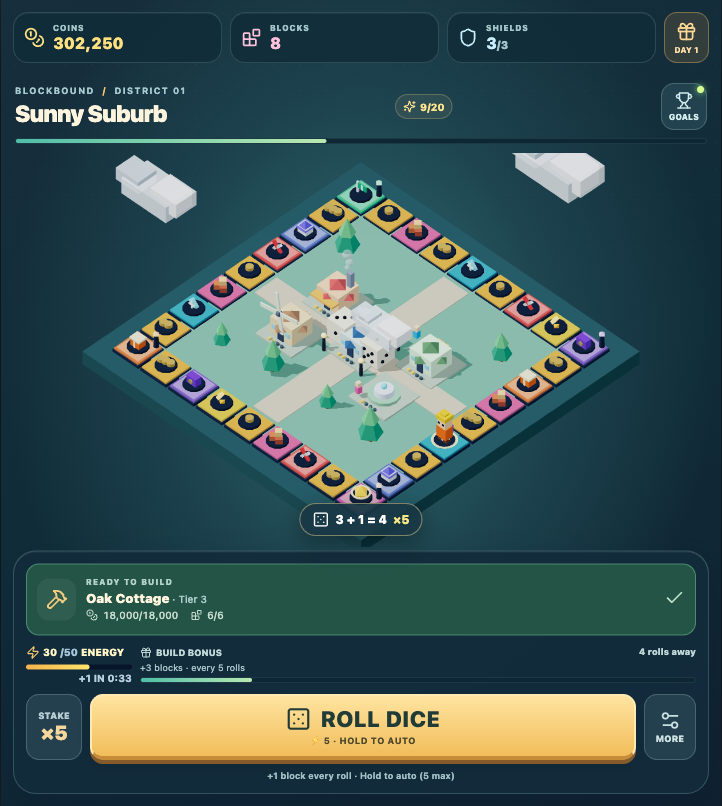

<p align="center">
  
</p>

<h1 align="center">🎲 Blockbound: Dice Districts</h1>

<p align="center">
  <strong>Roll. Build. Raid. Rebuild.</strong><br />
  An original, portrait-first voxel board-and-town progression game built with React 18, Three.js / React Three Fiber, and Zustand for the mobile web, PWA, and Android.
</p>

<p align="center">
  <a href="docs/INDEX.md"><strong>📚 Documentation Index</strong></a> ·
  <a href="docs/ARCHITECTURE.md">Architecture</a> ·
  <a href="DESIGN.md">Design Language</a> ·
  <a href="TECHSTACK.md">Tech Stack</a> ·
  <a href="ROADMAP.md">Roadmap</a> ·
  <a href="CONTRIBUTING.md">Contributing</a> ·
  <a href="THIRD_PARTY_NOTICES.md">Third-Party Notices</a>
</p>

---

## 📸 Gameplay Gallery

<p align="center">
  
  
  
</p>
<p align="center">
  
  
</p>

*Live captures of Blockbound: Sunny Suburb 3D isometric board, standalone minigames (Town Raid), tier-by-tier voxel construction progression, and responsive mobile HUD.*

---

## 🌟 The Pitch

Build a miniature voxel world while rolling dice around a vibrant 32-tile perimeter board. Collect coins, building blocks, energy, and shields, trigger tactical encounters, upgrade district landmarks, and unlock diverse theme worlds (Sunny Suburb, Candy Harbour, Neon Metropolis).

### Core Pillars
* **Play First**: Deterministic turn cycle: roll → physical tumble → tile-by-tile character hop → landing resolution → build → save.
* **Tactile Voxel Toy-Box**: Chunky toy-scale 3D models, smooth camera damping, numbered 3D dice faces, and animated block assembly.
* **Responsive Mobile Ergonomics**: Portrait-first framing, thumb-zone controls, safe-area padding (`env(safe-area-inset-*)`), and overflow-guarded compact number formatting (`125K`, `1.28M`).
* **Rock-Solid Progression**: 81 automated tests, versioned `SaveV1` browser storage, monotonic offline energy catch-up, and idempotent reward payouts.
* **Ethical Engagement**: Non-coercive daily login rewards, transparent milestone curves, zero predatory lockouts, and no paywalled progression.

---

## 📊 Implementation Matrix

| System | Implementation Status | Verified Features |
| :--- | :--- | :--- |
| **Game Core & Rules** | ✅ **Complete & Verified** | 32 typed perimeter tiles, seeded dice RNG, deterministic roll lifecycles (`rollRules.ts`), 81 passing tests. |
| **3D Board & Scene** | ✅ **Complete & Verified** | React Three Fiber/Three.js scene (`VoxelScene.tsx`), 3 district themes (Emerald, Candy Strawberry, Cyber Neon), custom lighting and fog. |
| **Locomotion & Feel** | ✅ **Complete & Verified** | Tile-by-tile character hop progression (`characterHop.test.mjs`), tumble-settled 3D dice, Web Audio sound effects with mute toggle. |
| **District Progression** | ✅ **Complete & Verified** | 5 landmark silhouettes per district (`IslandView.tsx`), Tier 0–4 voxel stages, PvP damage & repair mechanics, warp transitions. |
| **Minigames** | ✅ **Complete & Verified** | Standalone **Vault Heist** (9 safes, 3 picks) and **Town Raid** (3 NPC targets, shield absorption) with pure TS contracts (`contracts.ts`). |
| **Timed Rotations** | ✅ **Complete & Verified** | Deterministic epoch rotation engine (4h flash, 24h daily, 7d weekly) with auto-turnover collection and 7-day streak rewards. |
| **Responsive HUD** | ✅ **Complete & Verified** | Compact coin/block abbreviation engine (`ResourceAmount.tsx`, `K/M/B`), flying reward bezier particles to HUD counters with bump pops. |
| **Persistence & Save** | ✅ **Complete & Verified** | Versioned `SaveV1` schema, automatic recovery from corrupt data, monotonic clock-safe offline energy regeneration (45s per unit). |
| **Mobile PWA** | ✅ **Complete & Verified** | Web manifest (`manifest.webmanifest`), service worker shell caching (`sw.js`), desktop hotkeys (`Space`, `Enter`, `R`, `M`). |
| **Android Sync** | ✅ **Complete & Verified** | Single-command distribution pipeline (`npm run sync:android`) synchronizing production web bundles directly to Android assets. |

---

## 🚀 Quickstart

### Prerequisites
* **Node.js** (v18+ recommended) & **npm**
* Modern web browser with WebGL support

### Running Locally

```bash
# Clone the repository
git clone https://github.com/sp80808/blockbound.git
cd blockbound/web

# Install dependencies
npm install

# Start development server
npm run dev
```

Open the printed address (default: `http://localhost:3000`).

### Quality Gates & Verification

```bash
cd web

# Run the automated test suite (81 unit and integration tests)
npm test

# Run strict TypeScript type checking
npm run typecheck

# Build optimized production bundle
npm run build

# Synchronize production web bundle to Android assets
npm run sync:android
```

---

## 🗂️ Project Directory Structure

```text
blockbound/
├── README.md                      # Project overview and visual gallery
├── DESIGN.md                      # Voxel art contract & design system
├── TECHSTACK.md                   # Technology specifications & contracts
├── ROADMAP.md                     # Milestone tracking & feature backlog
├── CONTRIBUTING.md                # Development standards & guidelines
│
├── docs/                          # Detailed engineering documentation
│   ├── INDEX.md                   # Comprehensive documentation index
│   ├── ARCHITECTURE.md            # System design & unified runtime architecture
│   ├── SAVE_RECOVERY.md           # SaveV1 schema & offline regeneration
│   ├── GAME_FEEL.md               # Tactile interaction & audio synthesis
│   ├── UI_UX_REVIEW.md            # Mobile portrait ergonomics & safe areas
│   └── assets/                    # Project logos, icons, and gameplay screenshots
│
├── web/                           # Canonical game source (React 18 + R3F + Zustand)
│   ├── src/                       # Components, game logic, minigames & state
│   ├── tests/                     # 81 automated tests running under Node.js
│   └── public/                    # PWA manifest, service worker & icons
│
└── app/                           # Android native wrapper & WebView shell
    └── src/main/assets/www/       # Synced web bundle loaded by MainActivity.kt
```

---

## 🤝 Contributing & License

We welcome well-scoped pull requests, asset contributions, and bug reports. Please review [CONTRIBUTING.md](CONTRIBUTING.md) and [docs/ARCHITECTURE.md](docs/ARCHITECTURE.md) before submitting changes.

Third-party dependencies and notices are tracked in [THIRD_PARTY_NOTICES.md](THIRD_PARTY_NOTICES.md).
